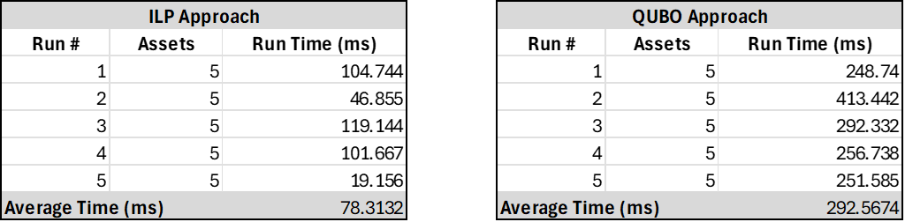

# pairs_trade_model
A research project that runs a high-frequency pairs-trading algorithm using both QUBO and ILP approaches, comparing their efficiency. The backtesting model, for performance comparison, is currently in development.

# Abstract
Arbitrage is a type of investment strategy that involves profiting from assets that trade at different prices across markets, buying an asset in a cheap market and simultaneously selling the same asset in an expensive market. Pairs-trading is a form of arbitrage that involves profiting from divergence in the performance of securities that are expected to perform similarly, betting that their performance will revert to the mean. This research implements an existing high-frequency pairs-trading algorithm using two approaches: A Quadratic Unconstrained Binary Optimization (QUBO) approach, and a Linear Programming (LP) approach. Overall, this research finds that the LP approach carries a significant increase in efficiency compared to the QUBO approach.

# Introduction
We begin by defining some key terms below, which will be imperative for understanding subsequent sections of this project.

*Arbitrage*\
Arbitrage is a trading strategy that aims to profit from asset price inefficiencies through the purchase and sale of financial instruments in different markets. There are several types of arbitrage strategies using different asset types and employing varying levels of directional biases. However, all arbitrage strategies aim to exploit price discrepancies while remaining market neutral, managing price movement risk, or both (Burgess, 2023).

*Pairs Trading*\
Pairs trading is a short-term strategy that is considered a form of statistical arbitrage. It involves finding asset pairs with correlated prices and profiting from divergence in their performance by shorting the high-performing asset, and buying the low-performing asset. The strategy effectively anticipates a mean-reversion in the performance of the pair, and profits from the subsequent convergence of asset prices (Gatev et al., 2006).

*High-Frequency Trading*\
High-frequency trading (HFT) is not a trading strategy, but a means of executing trading strategies that generally utilizes the “latest technological advances in market access, market data access and order routing to maximize the returns of established trading strategies” (Gomber et al., 2011, p. 3). While a generally accepted definition of HFT does not currently exist, characteristics of HFT generally include a very high order volume, rapid order cancellation, proprietary trading, short holding periods, and various other factors (Gomber et al., 2011, p. 17).

There are several research papers that have implemented high-frequency pairs trading (HFPT) strategies, including Bowen et al. (2010), Kim (2011), and Wang et al. (2021). Several research papers have also implemented Quadratic Unconstrained Binary Optimization (QUBO) techniques for financial applications using quantum-inspired hardware (Kalra et al., 2018; Buonaiuto et al., 2023; Leclerc et al., 2023; Zhang et al., 2024). Few papers, however, have used the QUBO framework to implement high-frequency arbitrage strategies (Tatsumura et al., 2023; Tatsumura et al., 2020). Tatsumura et al. (2023) execute an HFPT strategy using a QUBO optimization technique with a simulated bifurcation-based combinatorial optimization accelerator (Tatsumura et al., 2023). Tatsumura et al. (2023)’s algorithm is based on a network graph representation of the asset universe.

While QUBO-based optimization allows for the use of specialized quantum-based hardware, which can solve QUBO problems more efficiently than classical computers in many cases, ILP-based optimization carries multiple advantages against QUBO-based optimization (Lee & Jun, 2025). These advantages include more simple implementation of problems using constraints, greater applicability to modern solvers, and improved accessibility through everyday computer hardware.

There is not currently a robust base of literature comparing the efficiency of QUBO and integer linear programming (ILP)-based HFPT approaches using traditional computer hardware. This project aims to help fill this gap.

# Methodology
In this section, the HFPT algorithm that this research implements using both QUBO and ILP approaches is discussed. The algorithm generally follows the network-based algorithm used in Tatsumura et al. (2023).

*Network Graphs*\
This research utilizes a network graph approach to visualize the asset universe. An example network graph is provided below, representing a universe of four assets. The weight values relate to the interactions between each asset, or node.

Figure 1: Network Graph Representation of the Asset Universe\

*Cost Function and Optimization*\
The HFPT algorithm involves the use of a cost function, defined below.

Equation 1: Cost Function\

The algorithm aims to minimize the cost function, which represents the summed weights of activated edges, by optimizing the decision variable $b_{i,j}$. This optimization is formally defined below,

Equation 2: Cost Optimization\

where $w_{i,j}$ denotes the edge weights, and $b_{i,j}$ acts as a binary decision variable for whether an edge is activated.

*Weight Calculation*\
The expanded calculation of the weight variable, $w_{i,j}$, is shown in Equation 3 below.

Equation 3: Weight calculation\

Edge weights are the product of a similarity factor, $s_{i,j}$, and the spread between $ask_{j}$ and $bid_{i}$. $s_{i,j}$ is normalized within [0,1] and is calculated on a rolling daily basis. $ask_{j}$ denotes the lowest ask price for asset *j*, standardized on the ask price at the beginning of the calendar day. The variable $bid_{i}$ denotes the highest bid price of asset *i*, and is also standardized on the bid price at the beginning of the calendar day.

$w_{i,j}$ is at its lowest when  $s_{i,j}$ is at its highest and the spread is most negative. A negative spread suggests that asset *j* has declined in value relative to asset *i* since the beginning of the day. This indicates that the trader could profit from going long asset *j* at $ask_{j}$ and selling asset *i* at $bid_{i}$, profiting when their performance reverts back to the mean. 

The similarity factor, $s_{i,j}$, is based on a distance calculation using price data from a rolling one day window. It is based on the reciprocal dynamic time warping (DTW) distance between asset pairs, as shown in Equation 4 below.

Equation 4: Similarity Factor Formula\

DTW is an algorithm that measures the similarity of time-series data that differ in time frames, where a larger distance denotes lower similarity (Lee, 2019). As such, lower DTW distance leads to a similarity factor closer to one, and a higher DTW distance leads to a similarity factor closer to zero. 

*Model Output*\
The intended output of the model is a cycle, where the beginning and end of the cycle is signified by a null node. A given cycle either represents a direct or indirect path, and denotes which assets to be bought and sold. For example, the path (0 &rarr; A &rarr; B &rarr; 0) suggests that the most profitable trade would be to short asset A and go long asset B, where 0 represents the null node. This represents a direct path, because it only includes two assets. An example of a bypass path would be (0 &rarr; A &rarr; B &rarr; C &rarr; 0), which represents shorting A, both going long and shorting B, and going long C. Overall, it represents a pairs-trade between A and C, with the simultaneous purchase and sale of asset B. The bypass path could be more profitable than the direct path, depending on the edge-weights between bypass nodes and surrounding nodes. Bypass paths can include any number of bypass nodes, for example (0 &rarr; A &rarr; B &rarr; C &rarr; D &rarr; 0) denotes a pairs-trade between assets A and D, with bypass nodes B and C.

Below is an example of the model’s output in its raw form, as a binary matrix. There are five assets, with the null node noted as “null”. The binary values represent $b_{i,j}$ in Equation 1 and Equation 2, namely the activation of edges between each asset. The rows represent *i* and the columns represent *j* for each pair.

Figure 2: Matrix Representation of Model Output\

The above output denotes the path (0 &rarr; A &rarr; C &rarr; D &rarr; 0), or shorting A, simultaneously buying and shorting C, and buying D.

*Rules*\
To produce cycles that conform to the format described above, we need to set certain rules for the model to follow. Below, we define the rules that must be followed by the model. Note that the tabu list discussed in rule number 4 below represents a limited memory of recent model outputs to forbid duplicate pairs-trade results.

1. The inflow and outflow of each node must be 1 or 0
2. The inflow and outflow of each node must be equal
3. You cannot traverse the same edge twice in different directions
4. You cannot output a duplicate pairs-trade that has been outputted recently (you cannot output a tabu list pair)
5. Each output may only contain one cycle, and cannot contain multiple cycles (you must forbid subtours from occurring)

The implementation of these rules differs depending on the optimization method. In the subsections below, we discuss the implementation of these rules for both the QUBO and ILP optimization methods.

Note that this research uses lazy constraints to enforce the elimination of subtours for both approaches, using Gurobi’s callback method to identify and forbid subtours as they arise. This project also adds a constraint to both approaches to ensure that all cycles begin and end with a null node. Thus, this project violates the QUBO’s unconstrained nature, while Tatsumura et al. (2023) uses an unspecified external verification technique to ensure these rules are enforced.

*Rule Enforcement: QUBO*\
Below is a penalty term for the QUBO that forbids breaking rules one to four above, introduced by Tatsumura et al. (2023).

Equation 5: Penalty Function\

In the above equation, $T_{i,j}$ represents an indicator for whether the pair *i,j* is in the tabu list, and the index 0 represents the null node. The weight between any node and the null node is 0.

Tatsumura et al. (2023) explains the purpose of each term below:

"The first (/second) term forces the outflow (/inflow) of each node to be 1 or less. The third term forces the inflows and outflows of each node to be equal. The fourth term forbids traversing the same edge twice in different directions. The fifth term forbids choosing the pairs in the tabu list $T_{i,j}$. Constraint violations increase the penalty, with $H_{penalty}$ = 0 if there are no violations." (Tatsumura et al., 2023, p. 104409)

Next, we adjust the optimization function in Equation 2 to include this penalty function, which increases the cost function when rules are broken, disincentivizing incorrect outputs. The updated overall cost function for the QUBO is shown below, where $m_{c}$ and $m_{p}$ are cost and penalty hyperparameters, respectively. In the results section below, the cost and penalty hyperparameters are set as 1 and 100000000, respectively, to ensure that all of the rules are enforced by the penalty function. The efficiency and quality of results will depend on the balance of hyperparameters between the cost and penalty function.

Equation 6: QUBO Total Cost Function\

*Rule Enforcement: ILP*\
Because the ILP is capable of using constraints, the implementation of the rules is more simple and involves the simple constraints shown below, where n represents the collection of assets in the universe.

Equation 7: Inflow of Each Asset Must be One or Less\

Equation 8: Outflow of Each Asset Must be One or Less\

Equation 9: Inflow and Outflow Must be Equal\

Equation 10: Exclude Pairs in the Tabu List\

Equation 11: Null Node Required\

# Results

In this section, we display the results of running the algorithm with both the QUBO and ILP techniques for five assets, showing the time required to run the model for both techniques. Time is denoted in milliseconds. The input data to the model are cryptocurrency futures order-book data, specifically the first five seconds of futures data in May 2023 based on five popular cryptocurrencies: Bitcoin, Binance Coin, Ethereum, XRP, and Solana. The data was taken from Binance's open-access database ("Orderbook Cryptocurrency," 2023).

Figure 3: Model Run Time Table\

As shown in Figure 3 above, the ILP approach derived significant efficiency gains compared to the QUBO approach with five assets. The average run time across five trials for the QUBO approach is around 293 milliseconds, while the average run time for the ILP is around 78 milliseconds. This makes the ILP almost 275% faster than the QUBO. However, the total objective function for the QUBO was, on average, 1.5% lower than the ILP, suggesting the QUBO produced better results. This is dependent on the hyperparameters used for the QUBO.

For additional information on the data used in the run table, please see Appendix A. For additional information on the hardware and software used for the results, please see Appendix B.

# Conclusion
This research finds that the ILP approach performs more efficiently than the QUBO approach when solving Tatsumura et al. (2023)’s HFPT algorithm using traditional computer hardware. While this may highlight an advantage of using the ILP against the QUBO in cases involving traditional computers, it is imperative to understand that results will differ depending on the hardware available. For example, Tatsumura et al. (2023)’s specialized quantum computing hardware achieved a run time of 33 microseconds across 15 assets with the QUBO method, which is orders of magnitude more efficient than the results achieved in this project. The QUBO provided superior results, however, with a 1.5% lower objective function than the ILP approach, on average. This result will vary dependending on the cost and penalty hyperparameters applied to the model.

There are several questions outside the scope of this research that future researchers can investigate. Potential areas of future research include a live trading implementation of the ILP approach and an evaluation of its investment performance compared to the QUBO, the application of ILP and QUBO techniques to other investment strategies, and an analysis of the tradeoffs between the ILP and QUBO techniques in various scenarios, including different numbers of assets, asset classes, and market environments.

# References, Appendices, and Source Code
[Download Full Paper to View](</Full Paper/PH CSP Research Paper.pdf>)